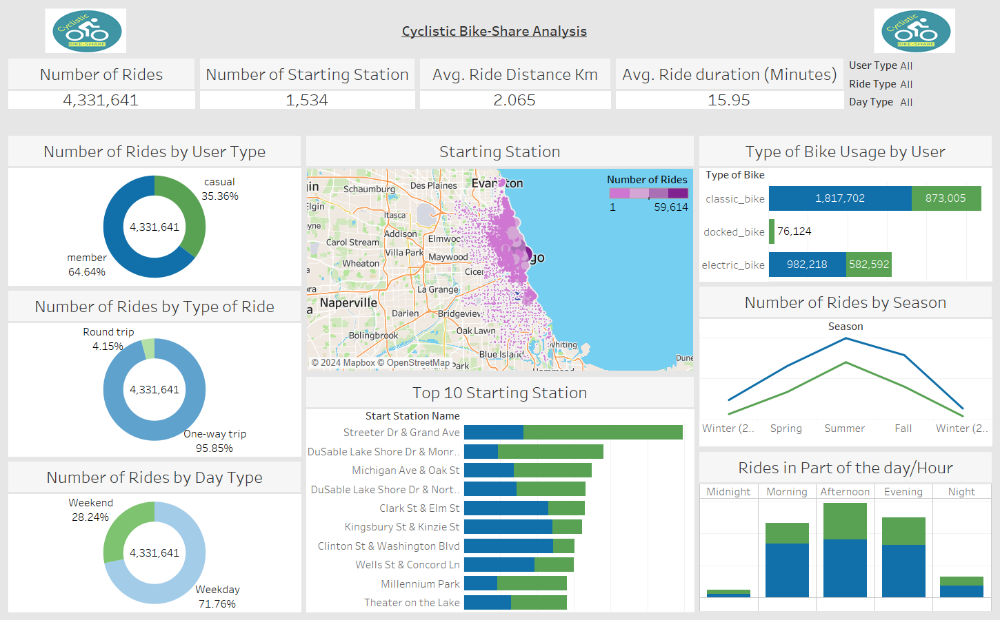
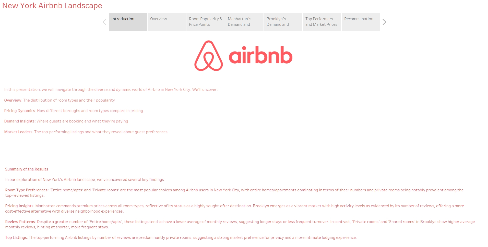
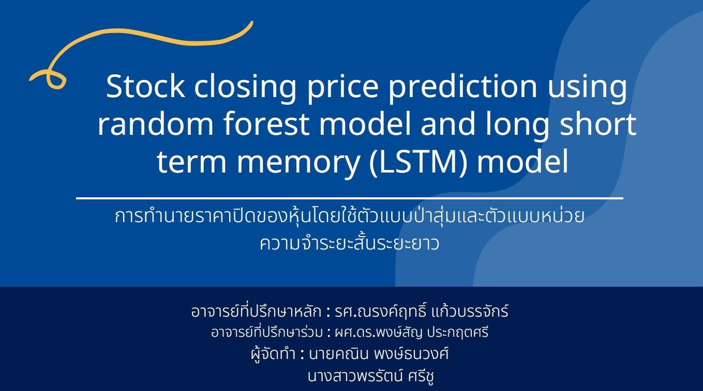

Graduate in Applied Mathematics with a strong foundation in data analytics and predictive modeling, gained through academic studies and projects. Co-authored a research article focusing on machine learning that was recently accepted for publication and certified as a Tableau Desktop Specialist. Eager to apply analytical skills as a Data Analyst to solve complex problems and support data-driven decision-making.

## Education
Bachelor of Science, Applied Mathematics, 2023

## Project
* **Google Data Analytics Capstone:** Cyclistic Bike-Share Analysis

  
  **Click the image to visit the link**
  
  This project was part of the Google Data Analytics Professional Certificate, aimed at demonstrating the skills and knowledge acquired throughout the course. We performed the data analysis process: Ask, Prepare, Process, Analyze, Share, and Act to analyze over 4,000,000 bike share records. The goal was to uncover user behaviors and preferences to develop actionable recommendations. We used Python to prepare, process, and analyze the data. Additionally, we used Tableau to create an interactive dashboard to visualize findings and insights. The Github repository of this project can be accessed [here](https://github.com/KaninPongtanavong/Cyclistic-Bike-Share-Analysis)

* **Data Visualization with Tableau Project:** New York Airbnb Landscape
  
  
  **Click the image to visit the link**

  This project was part of the Data Visualization with Tableau Specialization certificate, focusing on using data visualization techniques to explore Airbnb listings in New York City. As part of this project, a Tableau storyboard was created to uncover pricing trends and guest preferences, providing actionable insights using Airbnb listing data from the last 12 months leading up to September 5, 2023, with over 30,000 listings. The analysis aimed to gain insights into factors influencing property prices and listing success, covering details about hosts, property types, prices, and guest reviews. The findings were presented clearly and engagingly to demonstrate data storytelling skills.

* **Applied Mathematics Project:** Stock Closing Price Prediction using random forest model and LSTM model
  
  
  **Click the image to visit the link**
  
  Developed predictive models to forecast the closing prices of 10 stocks across various industries (telecommunications, banking, mass transportation, insurance, and energy) using random forest and long short-term memory (LSTM) techniques. The dataset included daily open, close, high, and low prices from June 1, 2019, to June 27, 2022. The objective of this study was to predict stock closing prices and compare the performance of both models, along with examining the next day's stock closing price predictions by the best-performing model. This project was part of my B.S. in Applied Mathematics program.

## Publication
Pongtanavong, K., & Kaewbanjak, N. (in press). Comparative Analysis of Long Short-Term Memory and Random Forest Models for GULF Stock Closing Price Prediction.

## Certificate
* Google Data Analytics Professional Certificate, Google (2024)
* Data Modeling in Power BI, Microsoft (2024)
* Tableau Desktop Specialist, Tableau (2024)
* Microsoft Azure SQL, Microsoft (2024)
* Extract, Transform and Load Data in Power BI, Microsoft (2024)
* Explore Core Data Concepts in Microsoft Azure, Microsoft (2024)
* Harnessing the Power of Data with Power BI, Microsoft (2024)
* Data Visualization with Tableau Specialization, University of California, Davis (2024)
* Preparing Data for Analysis with Microsoft Excel, Microsoft (2023)
* SQL for Data Science, University of California, Davis (2023)
* Microsoft Certified: Azure AI Fundamentals, Microsoft (2023)
* AI on Cloud, Asian Institute of Technology (2023)
* Risk Management, Chulalongkorn University (2022)
